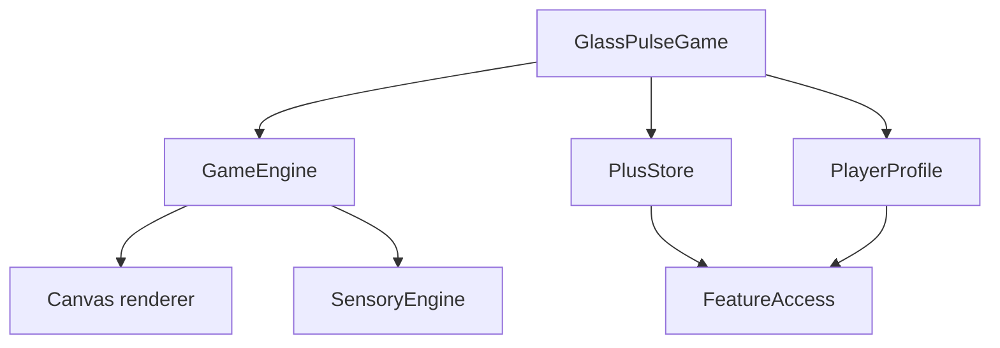

# Glass Pulse architecture

> updated 2026-08-30 · pre-release

Product direction: [product.md](../biz/product.md). Canonical rules: [gameplay.md](../feat/gameplay.md).

## Boundaries

- `GameEngine` is `@MainActor @Observable` because TimelineView drives mutable frame state that SwiftUI observes.
- `GameState`, `Obstacle`, `Gem`, economy rules, effects, and seeded random state are values; `paused` is an explicit state that resets the frame clock on resume.
- Rendering is an extension of GameEngine so Canvas consumes one state source without a second scene graph.
- `SensoryClient` isolates UIKit haptics and AVFAudio from core gameplay; tests inject its silent value.
- `PlayerProfile` owns UserDefaults persistence for high score, streak, shards, and selected/owned themes.
- `PlusStore` owns StoreKit 2 products, verified transactions, entitlement refresh, restore, and the long-running `Transaction.updates` listener.
- `FeatureAccess` combines the verified Plus entitlement with the compile-time `GLASS_PULSE_BETA` channel. Only unsigned CI archives receive that condition; beta access is never persisted as a purchase.

## Concurrency

UI state is main-actor isolated. StoreKit calls use async/await, busy-state cleanup uses `defer`, and transaction verification fails with concrete errors instead of unlocking on an unverified result.
