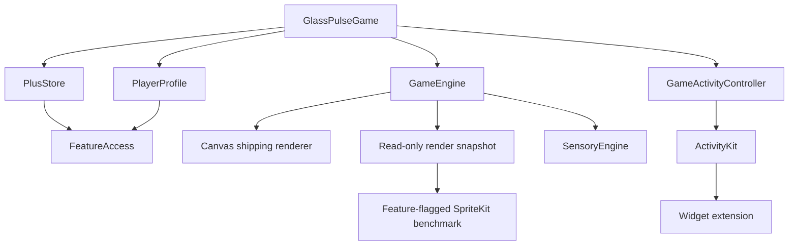

# Glass Pulse architecture

> updated 2026-08-30 · pre-release

Product direction: [product.md](../biz/product.md). Canonical rules: [gameplay.md](../feat/gameplay.md). Build/verification: [build.md](../ref/build.md).

## Simulation boundary

- `@MainActor @Observable final class GameEngine` is the only mutable gameplay engine.
- `GameSessionContext` selects immutable mode/rules/seed state. Modes never subclass or duplicate the engine.
- Every mode keeps exactly one controlled ball, automatic motion and tap-to-reverse.
- `advance(to:)` owns the single simulation clock. Physics delta is clamped while mode/session elapsed time uses real foreground elapsed time; pause clears the frame clock so background time is not applied on resume.
- Classic remains the regression oracle. Rush, Precision, Wave and Daily add rule branches to the same collision/collection pipeline.

## Mode and persistence boundary

- `GameModeID`, `GameModeRules` and `GameSessionContext` are Sendable value types.
- Daily seed is derived from local calendar day plus a versioned ruleset. Classic/Precision Daily variants are bounded to 60 seconds; Wave uses its final-wave completion condition.
- `PlayerProfile` persists selected mode/theme, high score, shards, Daily best, completion streak and first-clear reward key in `UserDefaults`.
- The old launch-based streak keys are reset once during migration. Daily streak/bonus move only after a successful Daily completion.
- `FeatureAccess` is the single mode/theme access policy: production requires real Plus entitlement for premium modes; `GLASS_PULSE_BETA` exists only in the unsigned archive job.

## Rendering boundary

Canvas + `TimelineView` remains the production renderer. `GameEngine+Rendering.swift` consumes engine state directly and does not own scoring or simulation rules.

Debug/Beta builds add `OSSignposter` intervals for `SimulationUpdate` and `CanvasFrame`; Canvas CPU durations are sampled in 240-frame windows and logged as p50/p95/p99. `Sources/Rendering/SpriteBenchmarkView.swift` is a shape-only `SpriteView`/`SKShapeNode` benchmark path behind `--spritekit-benchmark`. It consumes `GameRenderSnapshot` and never owns game state.

`preferredFramesPerSecond: 120` is only a request in the benchmark path. Canvas stays default and `CADisableMinimumFrameDurationOnPhone` is intentionally absent until device measurements prove a benefit.

## Sensory boundary

- `SensoryClient` keeps gameplay rules independent from AVFAudio/Core Haptics/UIKit.
- `SensoryEngine` owns one `AVAudioEngine`, cached PCM tone buffers and fixed transient cues.
- Precision alone can feed 25 Hz-throttled angular proximity into reusable Core Haptics intensity/sharpness parameters.
- Unsupported devices keep UIKit transient feedback; pause/background/low proximity stop continuous haptics.
- Audio interruption and haptic reset paths recover without changing scoring state.

## StoreKit boundary

- `PlusStore` owns product discovery, verified `Transaction.currentEntitlements`, restore and the long-running verified `Transaction.updates` listener.
- `SubscriptionStoreView` owns the native weekly/monthly purchase presentation; it does not replace entitlement verification.
- Revoked/expired transactions do not unlock Plus. Missing receipts/signatures do not create access.
- Debug UI tests can inject a Plus entitlement only through code compiled under `DEBUG`; Release production cannot read that launch argument.

## ActivityKit / WidgetKit boundary

- `GlassPulseActivityAttributes` is shared by the app and `GlassPulseWidgetExtension`.
- `GameActivityController` starts Live Activity only for top-level Daily/Rush runs, updates on state/score events rather than every frame and ends on run end.
- Lock Screen/Dynamic Island content is local: mode, score, Rush remaining time, Daily streak and `Local best`. No backend/Game Center means no global rank.
- The current Live Activity does not require App Group storage; app-to-activity state travels through ActivityKit content. App Group sharing is deferred until provisioning requires a separate widget data surface.
- Re-signing an unsigned IPA may not preserve optional extension provisioning. That cannot block core game simulation or be claimed verified by simulator CI.

## CI / artifact boundary

XcodeGen owns project generation. Project-wide settings remain Swift 6 language mode, complete Strict Concurrency and warnings-as-errors. Standard build/test does not define Beta; only the unsigned device archive adds `GLASS_PULSE_BETA`.

The archive gate verifies `Assets.car`, `CFBundleIcons`, AppIcon asset metadata and the embedded widget extension. CI reports build timing and enforces a strict `<25 MiB` budget for the compressed IPA, uncompressed app and each extension.
